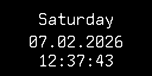

## Overview

**display-hata** is a Python application for Raspberry Pi Zero 2W that drives an SH1106 OLED display (128x64, blue) to cycle through information screens. Uses `luma.oled` for hardware rendering and `luma.emulator` (pygame) for local development.



## Hardware

- **Board:** Raspberry Pi Zero 2W
- **Display:** SH1106 OLED, 128x64 resolution, blue
- **Interface:** SPI (SCLK→P11, MOSI→P10, DC→P24, CS→P8/CE0, RST→P25)
- **Dev mode:** `luma.emulator` with pygame (no physical hardware needed)

## Raspberry Pi OS Configuration

### Enable SPI

The display uses the SPI interface. Enable it before installing the software.

**Non-interactive (one-liner):**

```bash
sudo raspi-config nonint do_spi 0
```

**Interactive:** Run `sudo raspi-config`, navigate to **Interface Options → SPI**, select **Yes**, then reboot.

After rebooting, verify SPI is active:

```bash
ls /dev/spidev0.*
# Expected: /dev/spidev0.0
```

## System Dependencies

Install required system packages:

```bash
sudo apt-get update
sudo apt-get install -y \
    git \
    python3-dev \
    python3-pip \
    python3-venv \
    libopenjp2-7 \
    libjpeg-dev \
    libfreetype6-dev \
    libssl-dev \
    libffi-dev
```

`spidev` and `RPi.GPIO` are Python packages and will be installed automatically by pip in the next step.

## Architecture

- **Device layer** — factory that returns either a real `luma.oled.device.sh1106` or a `luma.emulator.device.pygame` device based on environment.
- **Screen abstraction** — each screen extends `Screen` (in `screens/base.py`) and implements `draw()`. Screens have three key properties:
  - `interval: float` — many seconds this screen stays visible before the loop moves to the next one.
  - `live: bool = False` — when `True`, the screen redraws continuously every 0.5s for its interval (e.g. ticking clock). When `False`, it draws once and sleeps.
  - `prefetch()` — optional hook called in a background thread while the _previous_ screen is displayed, so slow I/O (HTTP requests) completes before the screen is drawn.
- **Screen loop** — main loop cycles through registered screens on a timer. Before each screen is shown, its `prefetch()` has already run in a background thread during the previous screen's interval.

## Screens

| Screen        | Description                                          |
| ------------- | ---------------------------------------------------- |
| `date`        | Current date and time with ticking seconds           |
| `weather`     | Temperature and condition via Open-Meteo API         |
| `smart_bikes` | Bike availability at a configured Smart Bike station |
| `adsb`        | Aircraft count within 50 km via adsb.lol / adsb.fi   |
| `cpu`         | CPU usage percentage                                 |
| `strava`      | Cycling distance and goal progress via Strava API    |
| `bf6`         | Battlefield 6 K/D ratio and kill/death counts        |

## Configuration

Copy the example config and edit it:

```bash
cp config.example.json config.json
```

`config.json` fields:

| Field         | Type     | Description                                                                  |
| ------------- | -------- | ---------------------------------------------------------------------------- |
| `screens`     | string[] | Ordered list of screens to display. Only listed screens are shown.           |
| `weather`     | object   | `lat` and `lon` for the weather screen.                                      |
| `smart_bikes` | object   | `station` — Tartu Smart Bike station name.                                   |
| `adsb`        | object   | `city` (display label), `lat`, `lon`, and optional `radius_km` (default 50). |
| `strava`      | object   | `goal_km` (default 1000) and `period` (`ytd`, `all`, or `recent`).           |
| `bf6`         | object   | `username` — Battlefield 6 player name. `platform` (default `"pc"`).         |

Every screen section accepts an optional `duration` (number) — seconds the screen stays visible before cycling to the next one. Defaults to 5.

Valid screen names: `date`, `weather`, `smart_bikes`, `adsb`, `cpu`, `strava`, `bf6`.
Screens without config (`date`, `cpu`) don't need a config section.

Example:

```json
{
  "screens": ["date", "weather", "smart_bikes", "adsb", "cpu", "strava"],
  "date": {
    "duration": 5
  },
  "weather": {
    "lat": 58.38,
    "lon": 26.72,
    "duration": 5
  },
  "smart_bikes": {
    "station": "Raatuse",
    "duration": 5
  },
  "adsb": {
    "city": "Tartu",
    "lat": 58.38,
    "lon": 26.72,
    "radius_km": 50,
    "duration": 5
  },
  "cpu": {
    "duration": 5
  },
  "strava": {
    "goal_km": 1000,
    "period": "ytd",
    "duration": 5
  },
  "bf6": {
    "username": "YourBF6Username",
    "platform": "pc",
    "duration": 5
  }
}
```

## Setup

### On the Raspberry Pi (production)

Clone the repository:

```bash
git clone <repo-url>
cd display-hata
```

Create a virtual environment and install dependencies:

```bash
python3 -m venv .venv
source .venv/bin/activate
pip install --prefer-binary --extra-index-url https://www.piwheels.org/simple -r requirements.txt
```

[piwheels](https://www.piwheels.org/) provides pre-built ARM wheels so compiled packages like Pillow install in seconds instead of building from source.

Copy the example config and edit it with your location and settings:

```bash
cp config.example.json config.json
nano config.json
```

If you use the `strava` screen, also set up credentials (see [Strava Setup](#strava-setup) below).

### On a desktop / laptop (development)

Uses [uv](https://docs.astral.sh/uv/) for dependency management:

```bash
uv sync --extra dev   # includes luma.emulator (pygame)
uv run python main.py --emulator
```

## Strava Setup

The `strava` screen requires OAuth2 credentials. One-time setup:

1. Create a Strava API application at https://www.strava.com/settings/api
2. Set the **Authorization Callback Domain** to `localhost`
3. Run the helper script and follow the prompts:

```bash
python strava_auth.py
```

4. Copy the output into a `.env` file in the project root (see `.env.example`)

The app automatically refreshes access tokens (they expire every 6 hours) and caches them in `.strava_cache.json`. Both `.env` and `.strava_cache.json` are git-ignored.

## Usage

```bash
python main.py --emulator     # run with pygame emulator (dev)
python main.py --gif out.gif  # record to GIF, Ctrl+C to save (dev)
python main.py                # run on real SH1106 display (Pi)
```

## Running in the Background

Use systemd to run display-hata automatically on boot and keep it running.

### Create the service file

```bash
sudo nano /etc/systemd/system/display-hata.service
```

Paste the following, adjusting `WorkingDirectory` and `ExecStart` if you cloned the repo to a different path:

```ini
[Unit]
Description=display-hata OLED screen cycler
After=network-online.target
Wants=network-online.target

[Service]
Type=simple
User=pi
WorkingDirectory=/home/pi/display-hata
ExecStart=/home/pi/display-hata/.venv/bin/python main.py
Restart=on-failure
RestartSec=10s

[Install]
WantedBy=multi-user.target
```

### Enable and start

```bash
sudo systemctl daemon-reload
sudo systemctl enable display-hata
sudo systemctl start display-hata
```

The service will now start automatically on every boot.

### Common commands

| Action    | Command                               |
| --------- | ------------------------------------- |
| Start     | `sudo systemctl start display-hata`   |
| Stop      | `sudo systemctl stop display-hata`    |
| Restart   | `sudo systemctl restart display-hata` |
| Status    | `sudo systemctl status display-hata`  |
| View logs | `journalctl -u display-hata -f`       |
| Disable   | `sudo systemctl disable display-hata` |
